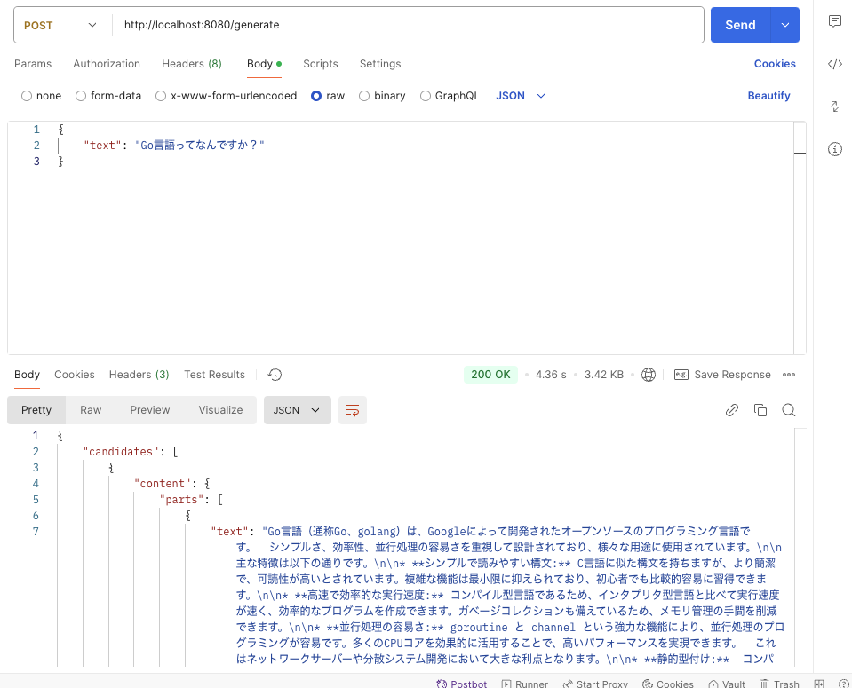

# Gemini API Integration with Go

このプロジェクトは、Google Cloud の Gemini API を Go言語で利用するためのシンプルなRESTful APIサーバーです。

## アーキテクチャ

```
├── cmd/
│   └── main.go           # アプリケーションのエントリーポイント
├── internal/
│   ├── config/          # 設定関連
│   │   └── config.go    # 環境変数の設定
│   ├── handler/         # HTTPハンドラー
│   │   └── gemini.go    # Gemini API関連のハンドラー
│   ├── service/         # ビジネスロジック
│   │   └── gemini.go    # Gemini APIとの通信ロジック
│   └── model/           # データモデル
│       └── gemini.go    # リクエスト/レスポンス構造体
├── .env                 # 環境変数ファイル
└── go.mod              # Go モジュール定義
```

### アーキテクチャの説明

このプロジェクトは、クリーンアーキテクチャの原則に従って設計されています：

1. **Presentation Layer (Handler)**
   - HTTPリクエストの受け取りとレスポンスの返却
   - リクエストのバリデーション
   - エラーハンドリング

2. **Business Logic Layer (Service)**
   - Gemini APIとの通信ロジック
   - ビジネスロジックの実装
   - エラー処理とリトライロジック

3. **Data Layer (Model)**
   - データ構造の定義
   - リクエスト/レスポンスのDTO

## セットアップ手順

1. リポジトリのクローン
```shell
git clone <repository-url>
cd gemini-question
```

2. 依存関係のインストール
```shell
go mod download
```

3. 環境変数の設定
`.env`ファイルを作成し、Gemini APIキーを設定：
```
GEMINI_API_KEY=your_api_key_here
```

4. アプリケーションの起動
```shell
go run cmd/main.go
```

## API使用方法

### テキスト生成 API

**エンドポイント**: `POST /generate`

**リクエスト形式**:
```json
{
    "text": "What is artificial intelligence?"
}
```

**レスポンス形式**:
```json
{
    "candidates": [
        {
            "content": {
                "parts": [
                    {
                        "text": "AIの説明テキスト..."
                    }
                ]
            }
        }
    ]
}
```

### POSTMANでのテスト方法

1. POSTMANを開き、新しいリクエストを作成
2. 以下の設定を行う：
   - Method: `POST`
   - URL: `http://localhost:8080/generate`
   - Headers:
     - `Content-Type`: `application/json`
   - Body (raw, JSON):
     ```json
     {
         "text": "What is artificial intelligence?"
     }
     ```
3. Sendボタンをクリックしてリクエストを送信

## エラーハンドリング

アプリケーションは以下のHTTPステータスコードを返します：

- 200: リクエスト成功
- 400: 不正なリクエスト（バリデーションエラー）
- 500: サーバーエラー（API通信エラーなど）

## 拡張性

このアーキテクチャは以下の機能追加に対応できるように設計されています：

- 新しいエンドポイントの追加
- レート制限の実装
- キャッシュ機能の追加
- 認証・認可の追加
- モニタリングとロギングの強化

## Evidence

